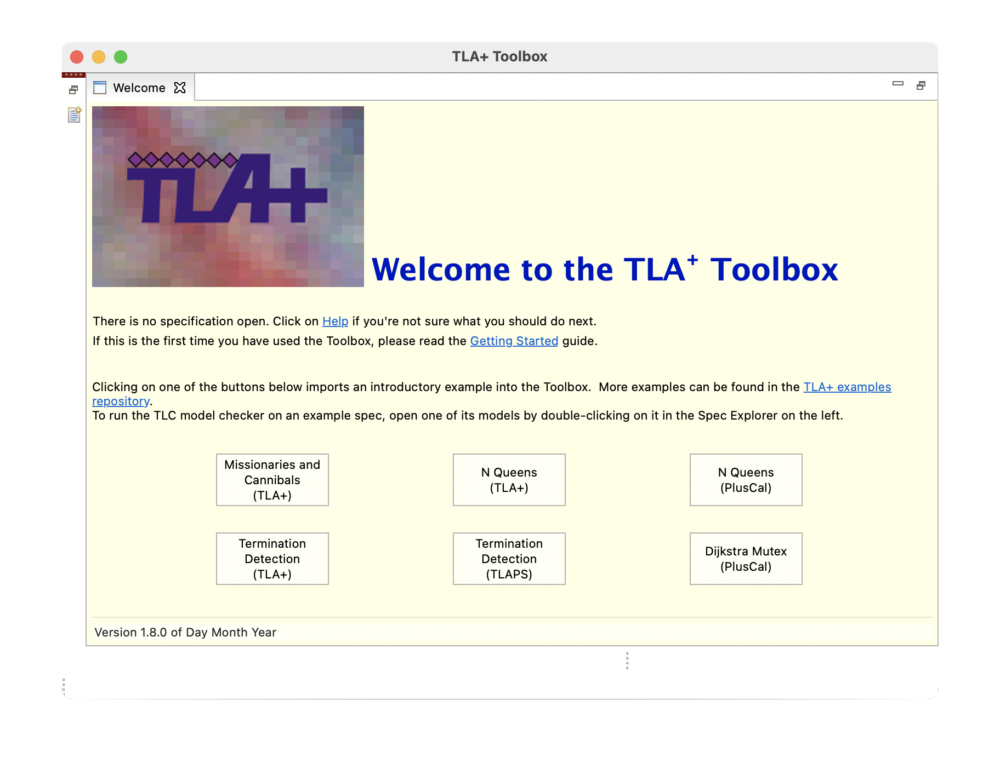
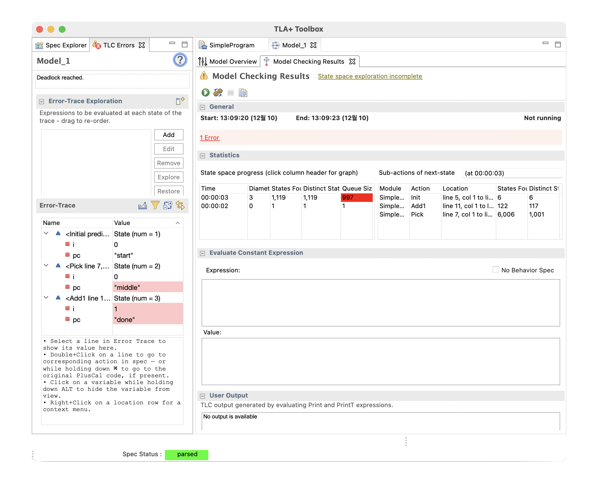

# TLA⁺

- [Homepage](https://lamport.azurewebsites.net/tla/tla.html)
  - [video](https://lamport.azurewebsites.net/video/videos.html)
  - [learning](https://lamport.azurewebsites.net/tla/learning.html)
  - Specifying Systems: [book](https://lamport.azurewebsites.net/tla/book.html?back-link=learning.html#book)
- [PlusCal](https://lamport.azurewebsites.net/tla/tutorial/contents.html)
- [Learn TLA+](https://learntla.com/)
- google group: [tlaplus](https://groups.google.com/g/tlaplus)
- github
  - tlaplus: [releases](https://github.com/tlaplus/tlaplus/releases)
  - [examples](https://github.com/tlaplus/Examples)
- [LaTeX](https://www.latex-project.org/)

---

## Install Toolbox

- tlaplus/tlaplus: [releases](https://github.com/tlaplus/tlaplus/releases)
- LaTeX
  - [MacTeX](https://tug.org/mactex/)



```bash
which pdflatex

/Library/TeX/texbin/pdflatex
```

### Usage

1. File → Preferences
   - Specifiy pdflatex command: `/Library/TeX/texbin/pdflatex`
1. File → Open Spec → Add New Spec...
   - Root-module file: [SimpleProgram.tla](src/SimpleProgram/SimpleProgram.tla)
   - Specification name: `SimpleProgram`
1. File → Produce PDF Version: `Option` + `Command` + `P`

#### Check TLC Model Checker

TLC Model Checker → New Model... → ▶︎ Runs TLC on the model.



Model Overview → Uncheck: Deadlock → ▶︎ Runs TLC on the model.

### Help

1. Help → Table of Contents
2. Read: Getting Started
